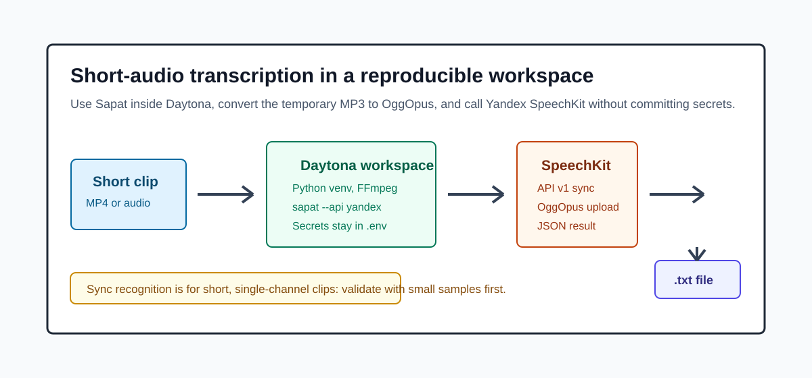

# Run Yandex SpeechKit with Sapat in Daytona

# Introduction

Short recordings are often the first place an AI transcription workflow proves
itself. A thirty-second product demo, support clip, user interview excerpt, or
meeting snippet is small enough to review by ear, but still realistic enough to
expose missing dependencies, broken credentials, language mismatches, and audio
conversion problems.

This guide shows how to run [Sapat](https://github.com/nibzard/sapat), a Python
CLI that converts media files and sends them to a speech-to-text provider, with
Yandex SpeechKit inside a reproducible
[Daytona workspace](../definitions/20240819_definition_daytona%20workspace.md).
The companion implementation is available in
[nibzard/sapat#53](https://github.com/nibzard/sapat/pull/53). It adds
`--api yandex`, converts Sapat's temporary MP3 file to the OggOpus format
required by Yandex SpeechKit API v1, and includes mocked tests so reviewers can
inspect the request without using a real API key.

Yandex's API v1 synchronous recognition endpoint is deliberately scoped to
small audio. The official documentation lists a maximum file size of 1 MB,
maximum duration of 30 seconds, and one audio channel. That makes it a good fit
for quick validation clips, not full podcast episodes or hour-long meeting
archives. For larger media, use an asynchronous recognition path or a provider
designed for long-running jobs.



## TL;DR

- **Use Daytona for repeatability**: Run Sapat in a clean workspace so Python,
  FFmpeg, and environment variables are visible to reviewers.
- **Use Yandex for short clips**: Select the provider with `--api yandex` and
  keep samples under the synchronous recognition limits.
- **Let Sapat handle conversion**: Sapat creates MP3 first, then the Yandex
  provider converts that temporary file to OggOpus before upload.
- **Keep secrets out of Git**: Store `YANDEX_API_KEY` or `YANDEX_IAM_TOKEN` in
  `.env` or Daytona-managed environment variables.

## Prerequisites

You will need:

- A GitHub account and a fork or clone of the Sapat repository.
- Daytona installed locally. Use the
  [Daytona installation guide](https://www.daytona.io/docs/installation/installation/)
  if you do not already have the CLI.
- Docker or another runtime supported by your Daytona setup.
- Python, `pip`, and FFmpeg inside the workspace.
- Yandex SpeechKit access through either an API key or an IAM token.
- A short test recording under 30 seconds while you validate the flow.

The commands below assume a Unix-like shell inside the Daytona workspace. The
same structure works from Windows, macOS, or Linux hosts because the active work
happens inside the workspace.

## Step 1: Open Sapat in Daytona

Create a workspace from your fork or the upstream Sapat repository:

```bash
daytona create https://github.com/nibzard/sapat --code
```

If the Yandex provider PR has not been merged yet, fetch it into the workspace:

```bash
git fetch origin pull/53/head:yandex-speechkit-provider
git checkout yandex-speechkit-provider
```

If you are applying the patch yourself, create a normal feature branch instead:

```bash
git checkout -b yandex-speechkit-provider
```

Keeping the provider work on its own branch makes the workflow easy to compare
with OpenAI, Groq, or Azure later. It also gives reviewers a small diff: CLI
routing, one provider module, tests, and documentation.

## Step 2: Install Sapat and FFmpeg

Create a virtual environment and install Sapat in editable mode:

```bash
python -m venv .venv
source .venv/bin/activate
python -m pip install --upgrade pip
python -m pip install -e .
```

Check that the CLI can see the Yandex provider:

```bash
sapat --help
```

The `--api` option should include `yandex`:

```text
--api [openai|groq|azure|yandex]
```

Sapat depends on FFmpeg for media conversion. Confirm it is available:

```bash
ffmpeg -version
```

On Debian or Ubuntu-based workspaces, install it with:

```bash
sudo apt-get update
sudo apt-get install -y ffmpeg
```

The Yandex provider uses FFmpeg twice in the full flow. Sapat first converts the
source video to MP3. The provider then converts that temporary MP3 to OggOpus
because Yandex SpeechKit API v1 synchronous recognition does not accept MP3.

## Step 3: Understand the sync boundary

Before configuring credentials, decide whether your source media belongs in a
[synchronous speech recognition](../definitions/20260527_definition_synchronous_speech_recognition.md)
workflow. This path is best when the user is waiting for a fast answer and the
clip is intentionally small. Think about voicemail previews, in-product voice
notes, quality checks for a larger pipeline, or a narrow excerpt from a longer
recording.

Do not hide the limit behind code. If your product needs whole meetings,
lecture archives, podcast backlogs, or hour-long customer calls, design around
asynchronous recognition from the start. Keeping that boundary explicit makes
the Sapat provider easier to review and prevents a short-audio endpoint from
turning into a fragile production queue.

## Step 4: Configure Yandex SpeechKit

Create a local `.env` file and keep it untracked:

```bash
cat > .env <<'EOF'
YANDEX_API_KEY=replace-with-your-api-key
YANDEX_IAM_TOKEN=
YANDEX_FOLDER_ID=
YANDEX_API_ENDPOINT=https://stt.api.cloud.yandex.net/speech/v1/stt:recognize
YANDEX_LANGUAGE=en-US
YANDEX_TOPIC=general
YANDEX_AUDIO_FORMAT=oggopus
YANDEX_SAMPLE_RATE_HERTZ=48000
EOF
```

Use one authentication mode at a time:

| Variable | Purpose |
| --- | --- |
| `YANDEX_API_KEY` | Service-account API key sent as `Authorization: Api-Key ...` |
| `YANDEX_IAM_TOKEN` | IAM token sent as `Authorization: Bearer ...` |
| `YANDEX_FOLDER_ID` | Folder ID for IAM token flows that require it |
| `YANDEX_LANGUAGE` | Recognition language, such as `en-US` or `ru-RU` |
| `YANDEX_TOPIC` | SpeechKit recognition model topic, defaulting to `general` |
| `YANDEX_AUDIO_FORMAT` | Provider conversion target, `oggopus` by default |
| `YANDEX_SAMPLE_RATE_HERTZ` | Used only when `YANDEX_AUDIO_FORMAT=lpcm` |

When you use an API key, leave `YANDEX_FOLDER_ID` empty. Yandex's SpeechKit
authentication documentation says API-key requests use the folder associated
with the service account. Set `YANDEX_FOLDER_ID` only when your IAM-token flow
requires it.

## Step 5: Validate without a live API call

Before sending any real media to Yandex, run the mocked tests from the provider
branch:

```bash
python -m unittest discover -s tests -v
python -m compileall src tests
sapat --help
```

These tests check that Sapat:

- exposes `--api yandex` through the Click CLI;
- accepts either API-key or IAM-token authentication;
- normalizes short language values such as `en` to `en-US`;
- converts audio to an upload format Yandex accepts;
- sends binary request data with the expected query parameters;
- returns the Yandex `result` field as Sapat's normal `text` field;
- raises useful errors for missing auth and failed API responses.

The mocked tests do not call Yandex and do not require secrets. They exist so a
reviewer can reason about the provider behavior from the pull request alone.

## Step 6: Prepare a short sample

Start with a tiny clip. This can be a screen-recording excerpt, a trimmed
meeting sample, or a generated test file. The important part is that the
converted request fits the synchronous API limits.

For a quick synthetic smoke test inside the workspace:

```bash
ffmpeg -f lavfi -i "sine=frequency=1000:duration=1" \
  -ar 44100 -ac 1 -b:a 96k sample.mp3
```

For a real video, trim the source before sending it:

```bash
ffmpeg -i full-demo.mp4 -t 20 -c copy demo-short.mp4
```

The trim step keeps the first live run cheap and reviewable. If transcription
quality looks poor, you can change one variable at a time: input audio, language
code, quality setting, or provider.

## Step 7: Run Sapat with Yandex

Run Sapat on the short file:

```bash
sapat demo-short.mp4 --api yandex --language en --quality M
```

The command performs this sequence:

1. Converts `demo-short.mp4` to `demo-short.mp3`.
2. Converts the temporary MP3 to mono OggOpus for Yandex.
3. Sends the OggOpus bytes to the SpeechKit synchronous endpoint.
4. Reads the JSON `result` value.
5. Writes the transcript to `demo-short.txt`.
6. Removes temporary audio files.

To use another language, pass either the full Yandex language value or a common
short code:

```bash
sapat demo-short.mp4 --api yandex --language ru --quality M
```

The provider maps `en` to `en-US`, `ru` to `ru-RU`, and similar common values.
If you need a language or topic outside that convenience map, set
`YANDEX_LANGUAGE` and `YANDEX_TOPIC` explicitly in `.env`.

## Step 8: Review and troubleshoot

Open the transcript:

```bash
sed -n '1,120p' demo-short.txt
```

Check the output against the source clip. For a short validation sample, listen
to the source once and verify the high-signal words: names, product terms,
numbers, and action items.

**Problem:** `sapat --help` does not show `yandex`.

**Solution:** Confirm you checked out the branch that contains
[nibzard/sapat#53](https://github.com/nibzard/sapat/pull/53), then reinstall:

```bash
python -m pip install -e .
```

**Problem:** The command fails before upload.

**Solution:** Check FFmpeg and the input file:

```bash
ffmpeg -i demo-short.mp4 -f null -
```

**Problem:** Yandex returns an authentication error.

**Solution:** Use either `YANDEX_API_KEY` or `YANDEX_IAM_TOKEN`, not both. If
you use an API key, keep `YANDEX_FOLDER_ID` empty. If you use an IAM token that
requires a folder ID, set `YANDEX_FOLDER_ID`.

**Problem:** The provider says the converted file is too large.

**Solution:** Trim the clip, lower the input duration, or use an asynchronous
provider. Yandex's synchronous recognition path is for short audio fragments.

## Conclusion

You now have a Daytona workflow for running Sapat with Yandex SpeechKit on
short audio samples. Daytona keeps the Python environment, FFmpeg dependency,
provider code, and validation commands in one reproducible workspace. Sapat
keeps the CLI stable across providers, while the Yandex provider handles the
extra conversion step needed by SpeechKit API v1.

The key is honest scoping. Synchronous recognition is excellent for small clips
that need a fast request-response loop. For long meetings, podcasts, and batch
archives, use an asynchronous recognition path instead of stretching this one
beyond its documented limits.

## References

- [Sapat repository](https://github.com/nibzard/sapat)
- [Companion Yandex SpeechKit provider PR](https://github.com/nibzard/sapat/pull/53)
- [Yandex SpeechKit synchronous recognition](https://aistudio.yandex.ru/docs/en/speechkit/stt/request.html)
- [Yandex SpeechKit synchronous API reference](https://aistudio.yandex.ru/docs/en/speechkit/stt/api/request-api.html)
- [Yandex SpeechKit supported audio formats](https://aistudio.yandex.ru/docs/en/speechkit/formats.html)
- [Yandex SpeechKit authentication](https://aistudio.yandex.ru/docs/en/speechkit/concepts/auth.html)
- [Daytona installation guide](https://www.daytona.io/docs/installation/installation/)
